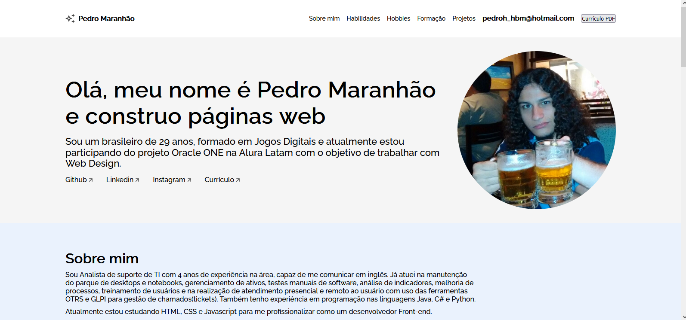

<h1>Portifólio</h1>

<a href="https://challenge-one-portfolio-br-master.vercel.app/" target="_blank">Link da página do projeto funcionando deployada no Vercel</a>

<h2>Sobre</h2>

Projeto de portifólio para ser usado como currículo

<h2>Detalhes</h2>
<ul>
<li>Responsivo para celular, tablet e computador</li>
</ul>

<h2>Mais informações</h2>

Projeto desenvolvido como requisito de qualificação da segunda fase do curso Oracle ONE, uma parceria entre a Oracle e a Alura para capacitação de desenvolvedores

